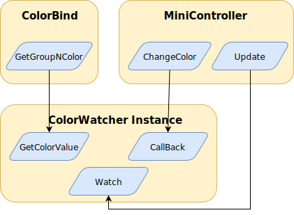

# ECS189L Programming Exercise 3: The Observer Pattern

## Description

The goals for this project are:
* To gain experience using the Watcher variant of the Observer design pattern.
* To implement and use the Publisher/Subscriber pattern.
* Implement functionality within the given project that adheres to the patterns presented in this assignment.

To learn more about the Observer design pattern, read the following:
* [Observer chapter](http://gameprogrammingpatterns.com/observer.html) from [Game Programming Patterns](http://gameprogrammingpatterns.com/) by Robert Nystrom
* [3. Observer Pattern](https://www.habrador.com/tutorials/programming-patterns/3-observer-pattern/) by Eric Nodreus

Here is a video from Microsoft's Visual Studio team about the pattern:  
* [Design Patterns: Observer and Publish-Subscribe](https://www.youtube.com/watch?v=72bdaDl4KLM)  

However, the watcher variant that will be implemented in this homework will be more inline with the polling version as discussed in lecture.

This project will have a barebones implementaion of a Real Time Strategy (RTS) game that will resemble the Pikmin games that were developed Nintendo.

If you are unfamiliar with either RTS or Pikmin, here are some resources:

https://en.wikipedia.org/wiki/Real-time_strategy

https://en.wikipedia.org/wiki/Pikmin

This project uses various C# capabilities of handing first-class functions and functional programming. The constructs used are:
* [Delegates](https://docs.microsoft.com/en-us/dotnet/csharp/programming-guide/delegates/)
* [`Action<T>` Delegates](https://docs.microsoft.com/en-us/dotnet/api/system.action-1?view=netframework-4.8)
* [`Func<TResult>` Delegates](https://docs.microsoft.com/en-us/dotnet/api/system.func-1?view=netframework-4.8)

### Grading

The points distrubtion for the stages totals to 70 points and can be found in the table below. The remaining 30 points are for your peer-review of another student's submission.

| Stage | Points |
|:-----:|:------:|
|  1.1  |   10   |
|  1.2  |   10   |
|  2.1  |   15   |
|  2.2  |   10   |
|  2.3  |   10   |
|  3.0  |   15   |

### Due Date and Submission Information

This exercise is due Thursday, October 24th at 11:59pm on GitHub Classroom. The master branch as found on your individual exercise repository will be evaluated.

## Description of Provided Unity Project

### Scene and Game Objects in the Hierarchy

This project constists of a single scene call `PikminiPlayground` that is located in the Assets/Scenes directory. The following are descriptions of the game objects in the scene that you will be interacting with for this exercise:  

* **ScriptHome** is an empty `GameObject` container for select scripts.  
* **Canvas** holds the user interface elements used to select shapes, colors, and send commands to the Pikminis.  
* **Cirlce Destination, Cube Desination, and Cylinder Destination** are the locations that the Pikiminis can be sent to.  
* **Spawn** serves as the initial spawn point for the Pikminis and is where the `GenerateMinis.cs` script resides.  

### Assets and Scripts

* **Prefabs/AniMini** is the prefab that will used to instantiate Pikminis. There is an alternate meeple-themed prefab named * **Mini** that you can explore as well.  

The following are the scripts involved in this project:  
* **ButtonManager.cs** is a utility script that holds properites and methods that are used for responding to button pressed in the user interface.
* **ColorBind.cs** holds the unique colors for *Group1*, *Group2*, and *Group3* of Pikminis. It also contains methods to retrieve the color of a group (which is critical for the watchers in Stage 1!). 
* **ColorBindings** is not a script but an instantiation of an asset created via the [CreateAssetMenu](https://docs.unity3d.com/ScriptReference/CreateAssetMenuAttribute.html) attribute of `ColorBind`. You will not have to deal with the details of this attribute in the project. However, it is a handy trick to have in your bag.
* **ColorWatcher.cs** is a partial implementation of the Watcher variant of the Observer pattern that you will complete it in this exercise.
* **GenerateMinis.cs** is the script that generates randomly-parameterized Pikminis. In the stock exercise project, it is a component of the `Spawn` game object.
* **MiniController.cs** contains information about and controls individual Pikminis. Each generated Pikimini contains a `MiniController` component. You will be heavily modifying this file throughout the exercise.
* **PublisherManager.cs** contains an instance of the PubSub pattern for each of the three groups of Pikminis. You will be writing most of this script.
* **IPublisher.cs** is the interface declaration for publishers in this exercise and mandages `Register`, `Unregister`, and `Notify` methods.
* **IWatcher.cs** is the interface declaration for watchers and mandates the `Watch` method.

## Stage 1: Watcher Pattern
In this stage, you will be creating a script that will watch the ColorBind script.
You will be using the polling watcher variant of the observer pattern to watch one of the three colors.
If one of the three colors in the ColorBind asset change (through manipulation within the editor), then the Game Object, one of the Minis, should change its own color. 

### 1.1: The Pikmini. Always watching, always changing.

This portion of the stage will require modification to the `ColorWatcher.cs` and `MiniController.cs`.

In order to have the Pikmini change `Color`, the Pikmini must be watching the `ColorBinding` asset.

Here is a diagram that shows the relationship an instance of `ColorWatcher` has to the other scripts:

In order to do this, you must:

* Create a new property of type `ColorWatcher` within the 'MiniController' class.

* Instantiate a new `ColorWatcher` object within the `Awake` function for the new property.

* Utilize the `Update` function within `MiniController.cs` in conjuction with the `ColorWatcher`s `Watch` method and the `ColorBinding` `ScriptableObject`. 

In order to properly get the Pikimini to `Watch`, `ColorWatcher` needs a more fleshed out `Watch` method. This method should:

* store the return value  of  `GetColorValue` to a variable. This variable should be named `PolledValue`.

* Compare the `PolledValue` to the current `Value`. 

* If the values are different, then invoke the `Callback` with the proper arguments.

If implemented correctly, the Pikminis should be updating their color to whatever group they have been randomly assigned. 

By altering the `Color` in the `ColorBinding` asset within the Editor, the Pikmini should update their `Color` accordingly.

### 1.2: The Pikmini, only watching sometimes now.

Turns out that watching something constantly can be a little offputting to both the Pikminis and the efficiency of your code. 

To fix this, use the `Throttle` field within the `MiniController.cs` to "throttle" how often a Pikmini should `Watch`.

It should look something like:

*  In `Update`, check to see if `TimeToWatch` is greater than `Throttle`.

* If it is, then let the Pikmini `Watch`.

* Reset `TimeToWatch`.

If implemented correctly, the Pikmini should have a delay before their `Color` changes.

## Stage 2: PubSub Pattern
In this stage, This stage will focus on the Publisher/Subscriber variant of the Observer pattern as discussed in lecture. 

### 2.1: Publish first, Subscribe second

The Pikmini have decided it's time to create the first of their publishers.

In this stage, create a new `Publisher.cs` that implements the `IPublisher.cs` interface.

At this point create the appropriate methods from the `IPublisher`. 

You should create `Register`, `Unregister`, and `Notify` methods within your own `Publisher.cs` file.

`Register` should `Add` the `Action<Vector3>` `notifier` to a `collection`.

`Unregister` should `Remove` the `Action<Vector3>` `notifier` from the `collection`

`Notify` should invoke all of the `Notifiers` with the correct argument.

### 2.2: Managing those rowdy publishers.

With this newly created `Publisher` class, `Instantiate` three publishers within `PublisherManager.cs`.

However, the `PublisherManager.cs` file needs its own `Register` and `Unregister`. `SendMessageWithPublisher` will be discussed in a later stage.

`Register` should check to see which `GroupID` has been passed in and `Register` the `callback` with the correct `Publisher`.

`Unregister` should check to see which `GroupID` has been passed in and `Unregister` the `callback` with the correct `Publisher`.

### 2.3: Sending messages

Now the Pikminis are able to register to a new publisher or drop that publisher like a hat. Unfortunately the Pikminis aren't able to get a message yet!

In order to do this, the `SendMessageWithPublisher` within the `PublisherManager.cs` file must be implemented for our small Pikminis to move around! 

`SendMessageWithPublisher` should `Notify` the correct `Publisher` with a `Message` of the new `Destination`.

At this point, by using the UIButtons, you should be able to click on a color button and a destination button to set which group should go where. The correctly colored Pikminis should move to the chosen destination.

## 3: A Mini Tale of Life and Death
Pikminis exist on the physical plane. Much like their fictional counterparts, Pikmin, Pikminis have a finite existance. 

Pikmini might love changing their color and moving to three different destinations, however their life spans range roughly around 10 to 40 seconds. 

Luckily, Pikminis are able to reproduce asexually. 

All that they need is a `Jump` command.

When player enters a `Jump` command, a Pikmini should spawn on the ancestoral home of the Pikmini, also know in the common tongue as `Spawn`.

To do this, you should create a script called `PikminiSpawner.cs` and attach it to the `Spawn` `GameObject`.

In this script when the `Jump` input is detected, a new Pikimini should be made through the `Instantiate` method based on the `Mini` prefab.

It is your choice to spawn Pikimini instances [`Input.GetButton`](https://docs.unity3d.com/ScriptReference/Input.GetButton.html) or [`Input.GetButtonDown`](https://docs.unity3d.com/ScriptReference/Input.GetButtonDown.html)   
